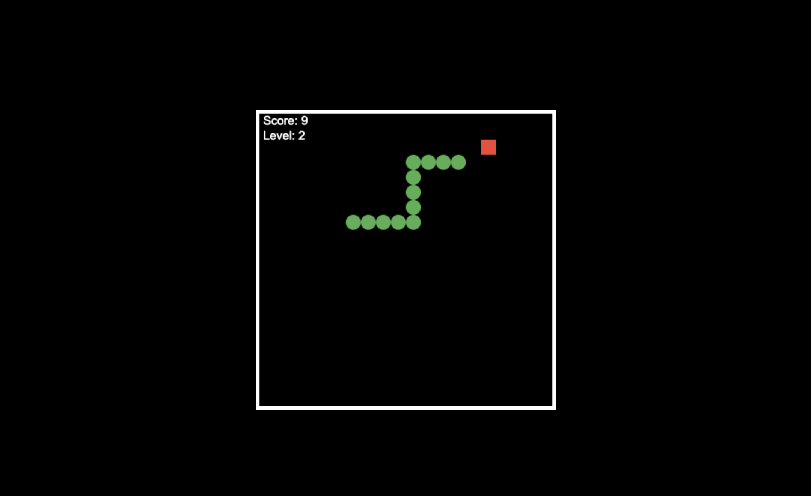

# Snake Game 🐍



Sebuah implementasi game klasik Snake menggunakan JavaScript dan HTML5 Canvas. Game ini menampilkan tampilan menu awal, skor, level, dan mekanisme permainan yang menantang.

## Fitur

- Tampilan menu sebelum memulai permainan
- Skor dan level
- Ular melewati dinding dan muncul di sisi berlawanan
- Game over saat ular menabrak dirinya sendiri

## Cara Menggunakan

Untuk menjalankan game ini di komputer lokal Anda, ikuti langkah-langkah berikut:

1. Clone repositori ini:

```bash
git clone https://github.com/juankair/snake-game.git